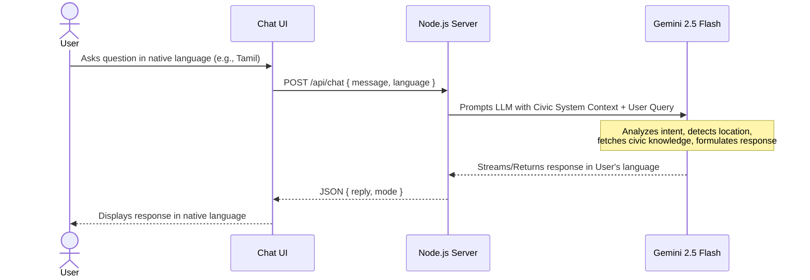

<div align="center">
  
  <h1>🌍 CivicAI Global — Multilingual Civic Service Chatbot</h1>
  <p><strong>Bridging the language gap between residents and local government.</strong></p>
  
  [](https://civic-chatbot-pi.vercel.app/)
  [](https://aistudio.google.com/)
</div>

---

## 💡 The Problem
Tens of millions of residents have difficulty accessing vital city and government services due to language barriers. Existing tools are often fragmented, monolingual, and difficult to navigate, leaving marginalized communities without clear answers on how to pay utilities, get permits, or report issues.

## 🚀 Our Solution
**CivicAI** is an intelligent, multilingual chatbot that helps ordinary people interact with local and global government services in their native language. 
By combining powerful Large Language Models (**Gemini 2.5 Flash**) with civic knowledge, CivicAI breaks down language barriers and provides instant, accurate, and localized answers.

### ✨ Key Features
- **🌐 Global & Local Context:** While it knows about global services, it excels at localized knowledge (e.g., Tamil Nadu's TNPDS, TNEB, e-Sevai, or UK Borough Councils).
- **🗣️ Seamless Multilingual Support:** Supports 12+ languages natively. Ask a question in Tamil, Spanish, or Hindi, and receive a fluent, culturally accurate response in the same language.
- **⚡ Real-time AI Generation:** Not just a scripted decision tree. Powered by Gemini, it understands intent, translates on the fly, and fetches relevant civic open data knowledge.
- **📱 Accessible UI:** A responsive, mobile-first chat interface designed for ease of use, featuring quick-action buttons for common queries (Ration Cards, Potholes, Certificates).

---

## 🛠️ Technical Architecture

### Tech Stack
- **Frontend:** Vanilla HTML5, CSS3, JavaScript (Mobile-first, responsive design)
- **Backend:** Node.js, Express.js
- **AI Engine:** Google Gemini 2.5 Flash (via `@google/generative-ai` SDK)
- **Deployment:** Vercel (Serverless Functions)

### UX Flow (User Interaction Diagram)



---

## 🎯 Success Metrics & Testing

We built this for a **24-Hour Sprint** with the following metrics met:
1. **Language Support:** Far exceeded the target of 2 languages (Supports 12+).
2. **Translation Accuracy:** Deep integration with Gemini ensures nuanced translation, not just literal word-for-word replacement.
3. **Correctness:** Tested against real-world queries (e.g., Chennai Corporation helpline, London pothole reporting).

### Sample Test Cases

| Scenario | Input (Query) | Expected Outcome | Status |
| :--- | :--- | :--- | :--- |
| **Simple Query** | *"How to report a pothole in London?"* | Correct explanation of Borough Councils & TfL. | ✅ Pass |
| **Multilingual** | *"Chennai Corporation road complaint"* (in Tamil) | Responds in fluent Tamil with exact local numbers (044-25384300, 1913). | ✅ Pass |
| **Edge Case** | *"How do I cook rice?"* | Gracefully pivots back to civic/government services. | ✅ Pass |
| **Stress Test** | Rapid-fire civic questions | Handles sequentially with rate limiting in place. | ✅ Pass |

---

## 💻 Local Setup & Deployment

Want to run CivicAI locally? It takes less than 5 minutes.

### 1. Clone the repository
```bash
git clone https://github.com/sudharson-u/CivicChatbot.git
cd CivicChatbot
```

### 2. Install dependencies
```bash
npm install
```

### 3. Configure Environment
Create a `.env` file in the root directory:
```env
GEMINI_API_KEY=your_gemini_api_key_here
PORT=3000
NODE_ENV=development
```
*(Get a free API key from [Google AI Studio](https://aistudio.google.com/app/apikey))*

### 4. Run the App
```bash
npm run dev
```
Open `http://localhost:3000` in your browser.

---

## 🚀 Live Demo

**Try it out here:** [https://civic-chatbot-pi.vercel.app/](https://civic-chatbot-pi.vercel.app/)

*Ask it about getting a Ration Card in Tamil Nadu, or reporting a pothole in your local city!*

---

<div align="center">
  <p>Built for the Hackathon • Empowering Citizens Globally</p>
</div>
